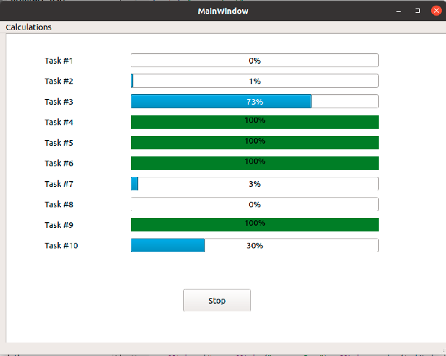
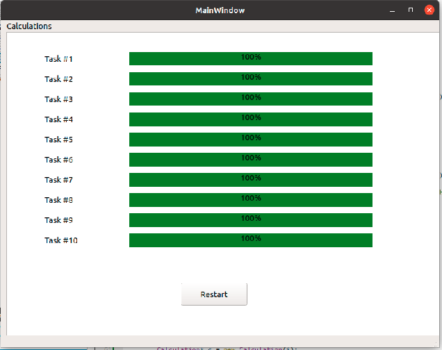

Это приложение, которое выводит 10 индикаторов прогресса (progress bars) для 10 ресурсоёмких задач

Для вычисления каждой задачи создаётся новый поток QThread. 
Но почему-то исполнение происходит в главном потоке, поэтому несмотря на множество созданных потоков для каждой задачи, работает только главный.

Создал имитацию переключения выполнения работ через `QApplication::processEvents`, но несмотря на чередование, параллельного выполнения нет.

# Запуск
1. sudo chmod +x ./progress_bars
2. ./progress_bars

# Скриншоты работы

